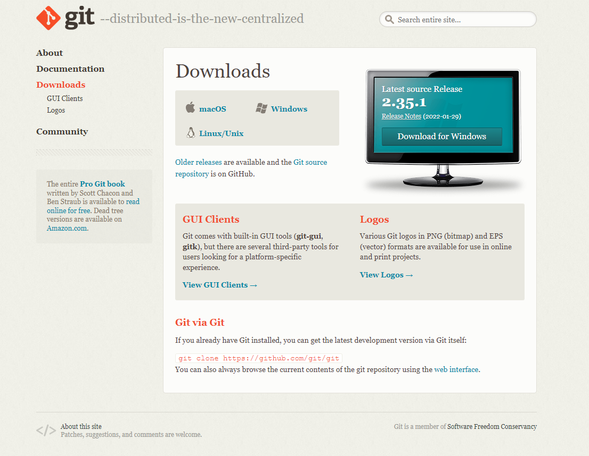
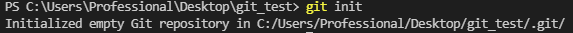
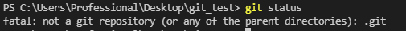
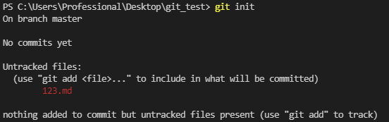
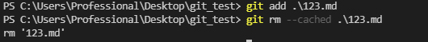
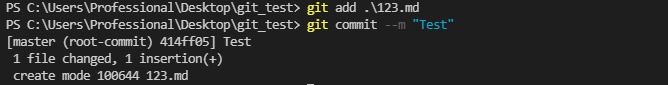
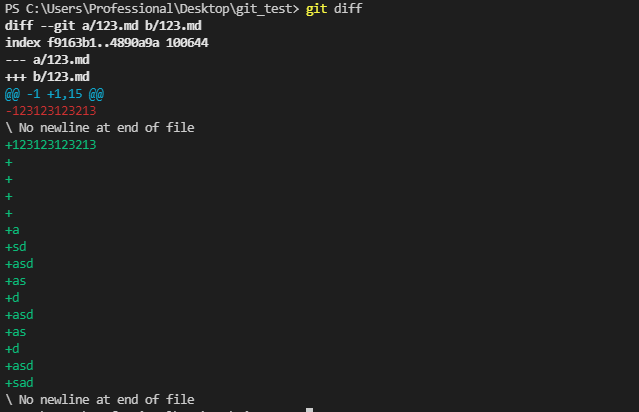
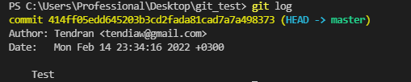

# <center>Работа с **Git**</center>

## <center>1. Проверка наличия установленного **Git**

В терминале необходимо выполнить команду *`git version`*. Если **Git** установлен - появится сообщение с информацией о версии программы. Иначе появится сообщение об `ошибке`.
<center> 

 


## <center>2. Установка **Git** 
</center>

Загружаем последнюю версию **Git** с [сайта](https://git-scm.com/downloads) *(https://git-scm.com/downloads)*.



Инструкция по установке **Git** на различных ОС - [Инструкция](https://git-scm.com/book/ru/v2/%D0%92%D0%B2%D0%B5%D0%B4%D0%B5%D0%BD%D0%B8%D0%B5-%D0%A3%D1%81%D1%82%D0%B0%D0%BD%D0%BE%D0%B2%D0%BA%D0%B0-Git).
## <center>3. Настройка **Git**</center>

При первом использовании **Git** необходимо *`представиться`*. Для этого используйте следующие команды: 
<center>

```
git config --global user.name "Ваше имя (Никнейм)"
git config --global user.email "Ваша почта (user@example.com)"
```
</center>

## <center> 4. Инициализация репозитория </center> 

Для инициализации репозитория используйте команду `git init`, чтобы **Git** смог работать с вашей папкой/файлами.
<center>



</center>

Если использовать команды для работы с **Git** без инициализации - вы получите `ошибку`!

<center>



</center>

##  <center> 5. Запись изменений в репозиторий </center>

Чтобы вносить изменения и прослеживать версии наших файлов нужно использовать слеющие команды:

* `git status` - позволяет посмотреть на какой части версий наших файлов мы находимся. Кроме того позволяет отследить файлы, которые мы не задействовали для контроля версий; позволяет посмотреть файлы, которые мы отправляем на сохранение для включения в контроль изменений. 
<center>



</center>

* `git add [название_файла]` - позволяет добавить файл в список для остлеживания (используется вместе с командой `git commit --m "комментарий"`). Чтобы удалить файл из списка используется команда `git rm --cached [название_файла]`.
<center>



</center>

* `git commit --m "комментарий"` - команда, которая делает снимок состояния проекта на текущий момент времени. Коммиты снимков состояния **Git** всегда выполняются в локальный репозиторий. 

<center>



</center>

* `git diff` - позволяет остлеживать изменения, которые произошли с прошлого снимка состояния проекта (*коммита*).

<center>



</center>

## <center> 6. Просмотр истории *коммитов* </center>

История снимков состояния проекта, или *`коммиты`*, могут быть просмотрены с помощью команды `git log`. С помощью этой команды мы можем увидеть `HASH`-код, с помощью которого мы можем перейти не предыдущую версию и посмотреть изменения. Так же, с помощью *`лога`* можно увидеть дату создания *`коммита`*, его *`Автора`* и *`комментарий`*, оставленный автором *`коммита`*.

<center>



</center>

