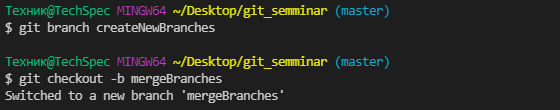

# <center>Работа с **Git**</center>

## <center>1. Проверка наличия установленного **Git**

В терминале необходимо выполнить команду *`git version`*. Если **Git** установлен - появится сообщение с информацией о версии программы. Иначе появится сообщение об `ошибке`.
<center> 

 


## <center>2. Установка **Git** 
</center>

Загружаем последнюю версию **Git** с [сайта](https://git-scm.com/downloads) *(https://git-scm.com/downloads)*.


Инструкция по установке **Git** на различных ОС - [Инструкция](https://git-scm.com/book/ru/v2/%D0%92%D0%B2%D0%B5%D0%B4%D0%B5%D0%BD%D0%B8%D0%B5-%D0%A3%D1%81%D1%82%D0%B0%D0%BD%D0%BE%D0%B2%D0%BA%D0%B0-Git).
## <center>3. Настройка **Git**</center>

При первом использовании **Git** необходимо *`представиться`*. Для этого используйте следующие команды: 
<center>

```
git config --global user.name "Ваше имя (Никнейм)"
git config --global user.email "Ваша почта (user@example.com)"
```
</center>

## <center> 4. Инициализация репозитория </center> 

Для инициализации репозитория используйте команду `git init`, чтобы **Git** смог работать с вашей папкой/файлами.
<center>


</center>

Если использовать команды для работы с **Git** без инициализации - вы получите `ошибку`!

<center>


</center>

##  <center> 5. Запись изменений в репозиторий </center>

Чтобы вносить изменения и прослеживать версии наших файлов нужно использовать следующие команды:

* `git status` - позволяет посмотреть на какой части версий наших файлов мы находимся. Кроме того позволяет отследить файлы, которые мы не задействовали для контроля версий; позволяет посмотреть файлы, которые мы отправляем на сохранение для включения в контроль изменений. 
<center>


</center>

* `git add [название_файла]` - позволяет добавить файл в список для остлеживания (используется вместе с командой `git commit --m "комментарий"`). Чтобы удалить файл из списка используется команда `git rm --cached [название_файла]`.
<center>


</center>

* `git commit --m "комментарий"` - команда, которая делает снимок состояния проекта на текущий момент времени. Коммиты снимков состояния **Git** всегда выполняются в локальный репозиторий. 

<center>


</center>

* `git diff` - позволяет остлеживать изменения, которые произошли с прошлого снимка состояния проекта (*коммита*).

<center>


</center>

## <center> 6. Просмотр истории *коммитов* </center>

История снимков состояния проекта, или *`коммиты`*, могут быть просмотрены с помощью команды `git log`. С помощью этой команды мы можем увидеть `HASH`-код, с помощью которого мы можем перейти не предыдущую версию и посмотреть изменения. Так же, с помощью *`лога`* можно увидеть дату создания *`коммита`*, его *`Автора`* и *`комментарий`*, оставленный автором *`коммита`*.

<center>


</center>

## <center> 7. Перемещение между сохраненными версиями (*коммитами*) </center>

Перемещение осуществляется с помощью команды `git checkout`. Для того, чтобы перейти на нужный нам *`коммит`* - нужен `HASH`-код этого *`коммита`*.

<center>


</center>

Чтобы перейти из более раней к основному "потоку" - `мастеру` - нужно использовать команду `git switch - ` (если после перехода на ранний коммит не было других команд), либо вернутся сразу к мастеру - `git checkout` *`master`*.

<center>


</center>

## <center> 8. Игнорирование файлов </center>

Игнорируемые файлы отслеживаются в специальном файле ***`.gitignore`***, который регистрируется в корневом каталоге репозитория. В **Git** нет специальной команды для указания игнорируемых файлов: вместо этого необходимо вручную отредактировать файл ***`.gitignore`***, чтобы указать в нем новые файлы, которые должны быть проигнорированы. Файлы ***`.gitignore`*** содержат шаблоны, которые сопоставляются с именами файлов в репозитории для определения необходимости игнорировать эти файлы.

Игнорируемые файлы — это, как правило, артефакты сборки и файлы, генерируемые машиной из исходных файлов в вашем репозитории, либо файлы, которые по какой-либо иной причине не должны попадать в *`коммиты`*. Примеры:

* скомпилированный код
* каталоги для выходных данных сборки
* файлы, сгенерированные во время выполнения
* скрытые системные файлы и т.д.

<center>


</center>

## <center> 9. Создание веток в **Git** </center>

Ветка в **Git** - это простой перемещаемый указатель на один из *`коммитов`*, обычно последний в цепочке *`коммитов`*. 

По умолчанию имя основной ветки в **Git** - *`master`*.

Чтобы создать новую ветку используйте команды:
```
git branch <имя_ветки>
git checkout -b <имя_ветки>
```
В результате создается новая ветка на текущий *`коммит`*. При использовании команды `git checkout -b <имя_ветки>` происходит создание ветки и переход на эту ветку.

<center>



</center>

Чтобы посмотреть список веток, которые были созданы используйте команду `git branch`.

<center>


</center>


## <center> 10. Слияние веток и разрешение конфликтов </center>
Для слияния выбранной ветки с текующей нужно выполнить команду `git merge <название выбранной ветки>`

<center>


</center>

Если была изменена одна и та же часть файла в обеих ветках, то может возникнуть `конфликт`, который потребует участия пользователя.


##  <center>11. Удаление веток</center>
 Чтобы удалить ветку используйте команду `git branch -d <имя_ветки>`. 
 **Перед удалием убедитесь, произвели ли вы слияние веток, если там новая нужная вам информация.**
<center>


</center>

**Если вы уверены в том, что изменения, которые вы не произвели, не несут важной для работы информации используйте команду для принудительного удаления:**  `git branch -D <имя_Ветки>`.

<center>


</center>

## <center> Перечень команд </center>

Чтобы посмотреть список команд нужно ввести команду `git help`.
 Для более развернутого листа стоит использовать `git help -a` и `git help -g` . Можно получить полный лист для определенной команды, к примеру `git help commit` . Комманда `git help git` открывает `HTML`-документ с общими инструкция (команды, синтаксис и пр.).

<center>


</center>

---


###### ***Выполнено,***
###### ***15.02.2022 0:07*** 
###### ***Куликовым Семеном,***
###### ***Студентом GB.ru.***


